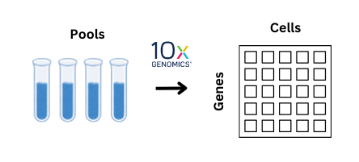
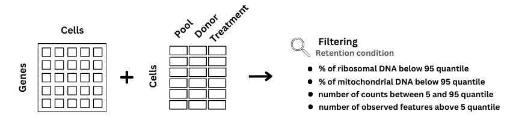
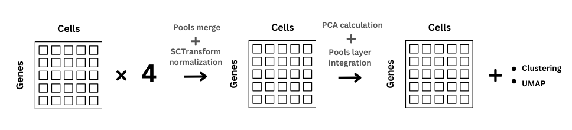
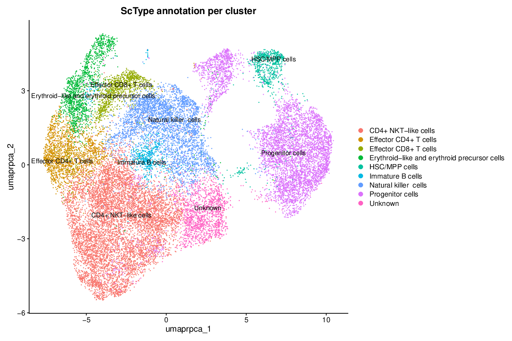

# iNKT-transcriptomics-analysis

Invariant natural killer T (iNKT) cells are a unique subset of lymphocytes that share
characteristics of both T cells and NK cells, bridging innate and adaptive immunity. These
cells are recognized for their role in anti-tumor responses and alleviation of acute graft-versus-
host disease (GvHD).

The application of iNKT cells in cancer immunotherapy has been limited, partly due to
the scarcity of studies on human iNKT cells compared to mice. While there are similarities
between human and mouse iNKT cells, key differences need to be addressed in clinical trials.
Humans also have fewer iNKT cells, which makes them harder to detect, especially in cancer
patients. To enhance the therapeutic potential of iNKT cells, understanding their heterogene-
ity and the roles of different subtypes is essential.

This study aims to explore the heterogeneity and functional roles of iNKT cell subtypes to enhance their therapeutic potential. Using single-cell transcriptomics (scRNA-seq) data from four healthy donors, we analyzed iNKT cells cultured with two treatments: interleukin 2 (IL-2) and interleukin 15 (IL-15) and discusses the selection of the most promising culturing methods for future immunotherapy applications.

## Pipeline

### Sample preparation

The experiments on iNKT cells were performed by collaborators from the Faculty of Medicine
in Pilsen of the Charles University, from the group lead by Dr. Monika Holubová. The isolation
and culture of iNKT cells involve a highly complex protocol with several critical steps.

The prepared cell cultures were grouped into four distinct pools, each containing samples from
two different donors, subjected to culture using different activator. These pools were sequenced using the 10x Genomics platform for single-cell RNA se-
quencing (scRNA-seq).

 

### Single-cell data analysis

To gain insights into the cellular heterogeneity and dynamics of the experimental system, the
R packages Seurat version 5 [Hao et al., 2024], ScType [Ianevski et al., 2022] and scVelo 0.3.2
[Bergen et al., 2020] were employed for single-cell RNA-seq data analysis.

#### `split_preprocessing.R`

Firstly, the data from pools in the form of H5 files (output from cellranger) were loaded, and annotations for each pool were created. Then pools were splited based on donor which lead to creation of 8 datasets each containing data from unique donot+treatment combination.

To ensure data integrity and comparability across the experimental datasets, a quality control was performed, retaining only cells that pass all filtering criteria. For filtering, the following functions were used: `quantile()` and the `subset` method on Seurat objects.

#### `split_integration.R`

Following this, gene expression counts within each donor +  treatment combination were
normalized to account for technical and biological variability using `SCTransform()`. Next, the normalized data from each dataset were
integrated using harmony methodology into a unified Seurat object, facilitating a comprehensive transcriptomic analysis. For this `IntegrateLayers()` function was used with `HarmonyIntegration` selected.

#### `so_preparation.R` + scvelo scripts

Final preparation steps involved:

* assessing cell cycle phase distribution using cell cycle genes from `celldex` library as the reference for `CellCycleScoring()` function
* annotating cell types using 2 different celltyping tools `SingleR` and `ScType`
* identifying distinctive gene markers using `PrepSCTFindMarkers` and `FindAllMarkers()` functions
* tracing cellular trajectories using `scvelo` python library, which required saving data to anndata object (`seurat_to_h5ad.R`)

#### `so_plots.R`

Generates number of different plots and saving them. Examples:

